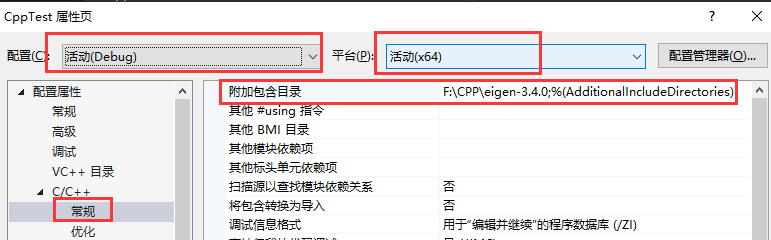

# CPPLearning
## c plus plus learning  
****
* [前言](#前言)  
* [0. bool type](#0-bool-type)  
* [1. reference](#1-reference)  
* [2. reference](#2-eigen)  

* [plan](#plan)  

### 前言
1、附加引用项配置 
当需要用到别的库的时候，需要配置引用项。 
如图：需要注意对应的配置和平台。例如，只配置了Debug，Release是找不到引用的。平台位数不对应，也不行~  
  

### 0. bool type
  
c++ bool 类型非0即1  0 为假 1 为真 
 

### 1. reference
引用是变量的别名，实际指向的是同一变量； 
这里比较有趣的是，声明为const的变量引用，引用本身不能修改，但引用指向的值会随原变量改变 
  
  
引用与指针的区别： 
1、引用访问一个变量是直接访问，而指针是间距访问； 
2、引用是一个变量的别名，和变量共享内存空间（本身不分配内存空间），而指针本身是一个变量，有自己独立的内存空间； 
3、声明引用必须初始化，一旦初始化就不能再引用其他变量，而指针可以（因为指针是变量）； 
 

### 2. eigen
[Eigen Documentation](https://eigen.tuxfamily.org/index.php?title=Main_Page#Documentation)   
[Eigen Api](https://eigen.tuxfamily.org/dox/annotated.html)  
C++的Eigen库是一个开源的线性代数库，它提供了丰富的功能用于处理矩阵、向量、线性方程组、特征值计算、矩阵分解和其他常见的数学运算。Eigen库的主要目标是提供高性能、简单易用且灵活的线性代数功能。简单记录一下，方便后期查找 
 
主要特点包括： 
高性能：Eigen库采用了优化的算法和数据结构，以实现高效的线性代数运算。它在性能上优于许多其他C++线性代数库。 
简单易用：Eigen库的设计使得它对用户非常友好，使用起来非常简单直观，无需繁琐的初始化和配置。 
纯模板库：Eigen库是一个纯模板库，所有功能都在头文件中实现。这意味着您只需要包含相应的头文件即可使用Eigen，而无需链接外部二进制库。 
跨平台：Eigen库在各种平台上都能很好地工作，因为它只依赖于C++标准库。 
 
Eigen库广泛应用于科学计算、工程学、图像处理、机器学习等领域，因为这些领域经常需要进行大规模的线性代数运算，而Eigen提供了高效且易于使用的解决方案。 
 

 
 

### plan
inline 内联函数  
构造/析构函数  
文件操作，二进制数据存取 

