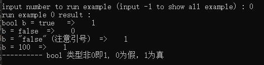
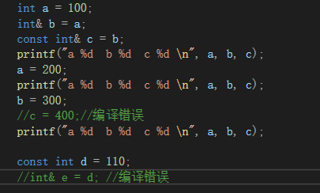
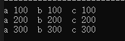

# CPPLearning
## c plus plus learning  
****
* [0. bool type](#0.-bool-type)  
* [1. reference](#1.-reference)  

### 0. bool type
  
c++ bool 类型非0即1  0 为假 1 为真 
 

### 1. reference
引用是变量的别名，实际指向的是同一变量； 
这里比较有趣的是，声明为const的变量引用，引用本身不能修改，但引用指向的值会随原变量改变 
  
  
 

